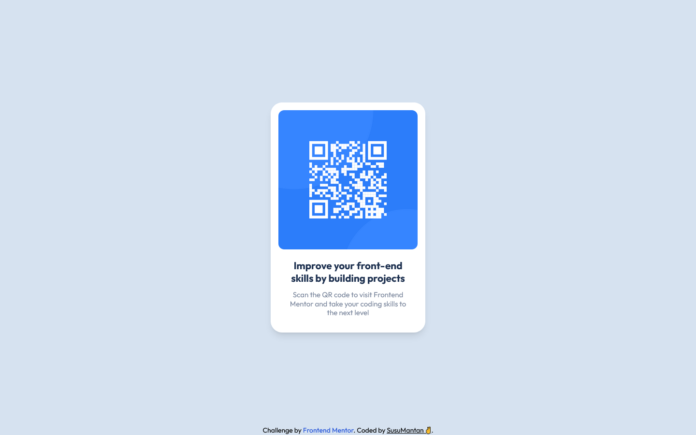

# Frontend Mentor - QR code component solution

This is a solution to the [QR code component challenge on Frontend Mentor](https://www.frontendmentor.io/challenges/qr-code-component-iux_sIO_H). Frontend Mentor challenges help you improve your coding skills by building realistic projects.

## Table of contents

- [Overview](#overview)
  - [Screenshot](#screenshot)
  - [Links](#links)
- [My process](#my-process)
  - [Built with](#built-with)
  - [What I learned](#what-i-learned)
  - [Continued development](#continued-development)
  - [Useful resources](#useful-resources)
- [Author](#author)
- [Acknowledgments](#acknowledgments)

## Overview

### Screenshot

### Links

- Solution URL: [GitHub Repo](https://github.com/agusthas/FEM_qr-code-component)
- Live Site URL: [GitHub Pages](https://agusthas.github.io/FEM_qr-code-component/)

## My process

### Built with

- Semantic HTML5 markup
- Mobile-first workflow
- [Tailwindcss](https://tailwindcss.com/) - CSS framework
- [Vite](https://vitejs.dev/) - Bundler and Server

## Author

- Frontend Mentor - [@susumantan](https://www.frontendmentor.io/profile/susumantan)
- Twitter - [@agusthas](https://www.twitter.com/agusthas)
